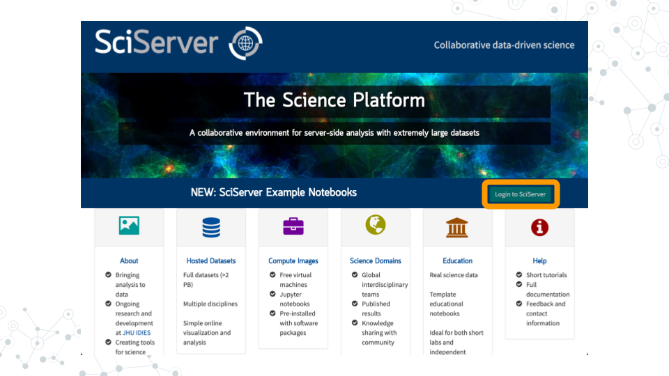
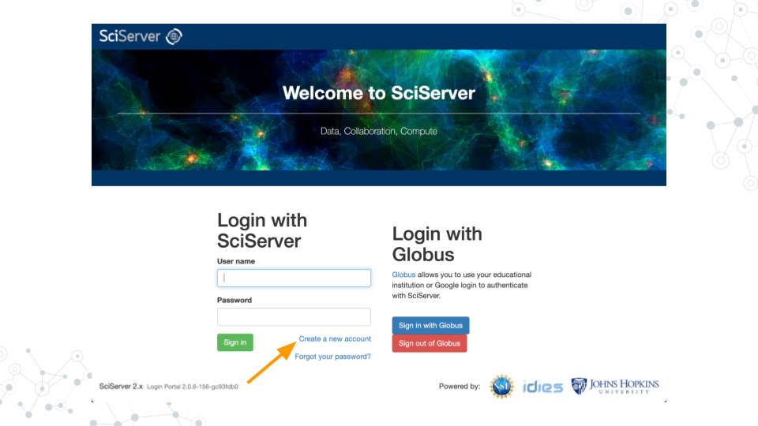
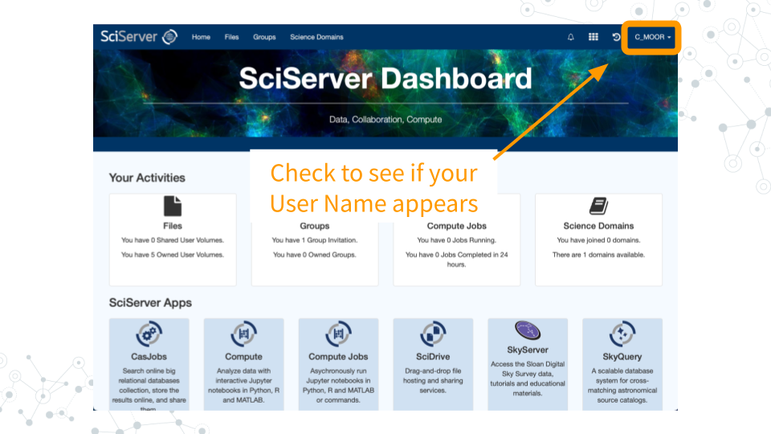

# Getting Started with SciServer

## What is SciServer?

SciServer is an online platform that provides access to big data resources to researchers worldwide. It is used by scientists studying astronomy, biology, oceanography, and more. It is free to use as long as you are using it for scientific research. Through using SciServer, you don’t need a fancy computer or need to install any special programs on your computer, you can simply log in with your internet browser to start doing research. For this course, we have set up SciServer with customized collections of programs for RNA-seq analysis, as well as the data that we’ll be analyzing. Once you sign up for SciServer and are added to the group for this course, you will be able to access these tools and begin your data analysis journey!

## Why use SciServer?

In this course, we will use the online SciServer platform in order to perform data analysis. The purpose of this assignment is to register for a SciServer account, and then to inform the instructor of your username so that you can be added to the SciServer group for this course and access course materials.

## Learning Objectives 

This chapter will cover:  

- How to create an account on SciServer
- How to confirm your email address
- How to share your username with your instructor

## Create an Account on SciServer

1. Open [sciserver.org](https://sciserver.org) in a web browser.

&nbsp;&nbsp;&nbsp;&nbsp;&nbsp; a. TIP: Bookmark this page so that you can easily access it throughout the course.

2. Click "**Login to Sciserver**"

3. Click "**Create a new account**"

4. Enter a username, email, etc. and click "**Create account**"

&nbsp;&nbsp;&nbsp;&nbsp;&nbsp; a. <u>Note that you cannot change your username.</u>

## Confirm Your Email Address

1. **Important!**: Click the verification link in your email inbox.

&nbsp;&nbsp;&nbsp;&nbsp;&nbsp; a. If you don’t verify your account, you will get locked out and will need to contact your instructor to unlock your account.

&nbsp;&nbsp;&nbsp;&nbsp;&nbsp; b. If you don’t see an email, try checking your spam folder.

2. After clicking the verification link, confirm that your username appears on the upper right hand corner of the webpage.

### Resources

[sciserver.org](https://sciserver.org)
[How to add a bookmark in Chrome](https://support.google.com/chrome/answer/188842)
[SciServer Help page](https://sciserver.org/support/how-to-use-sciserver/)

### References

Cox, K., & Tan, F. (2022, January 25). Join SciServer. C-MOOR. Retrieved June 27, 2023, from http://www.c-moor.org/miniCURE-RNA-seq/join-sciserver.html
