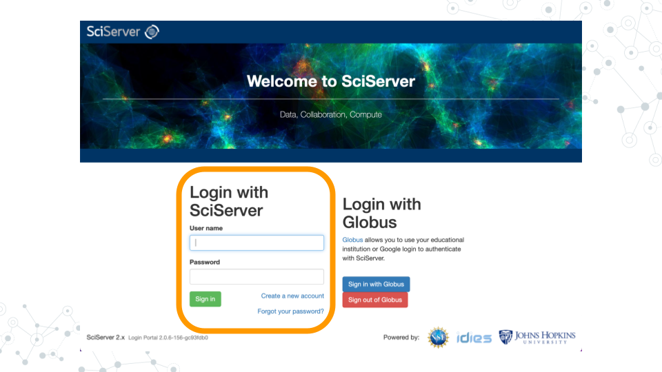
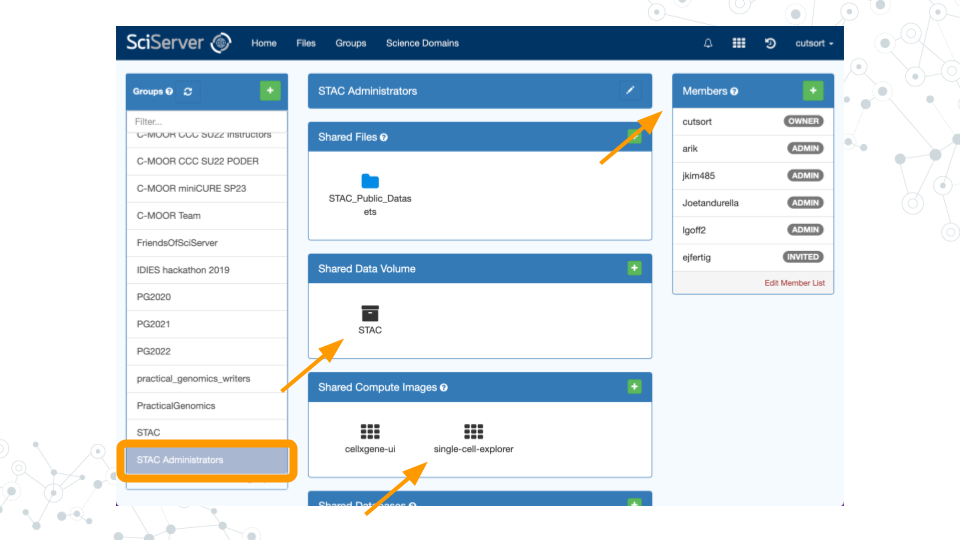
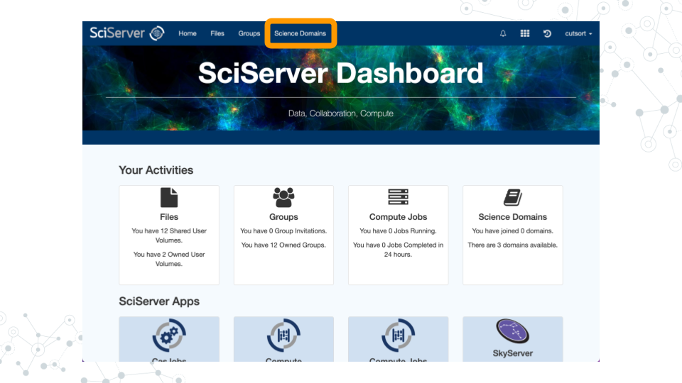
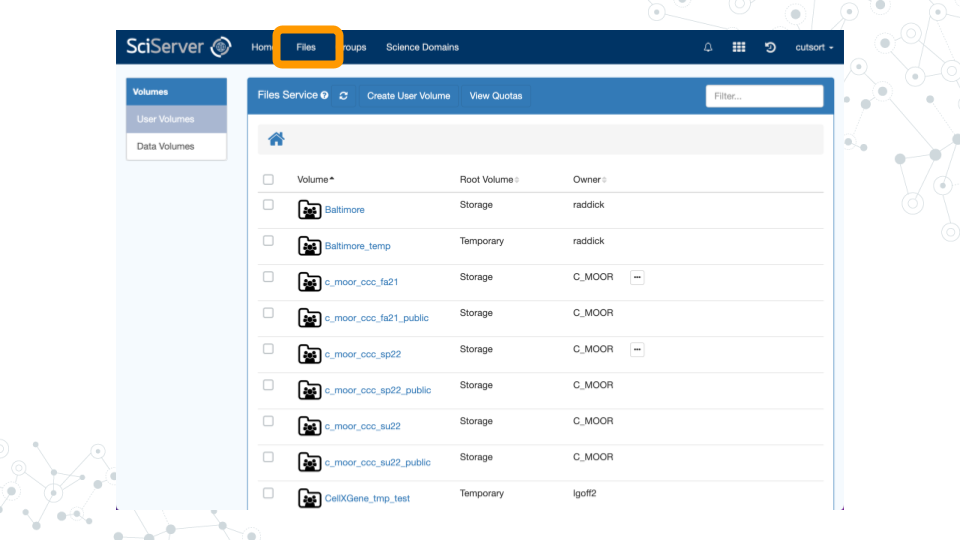
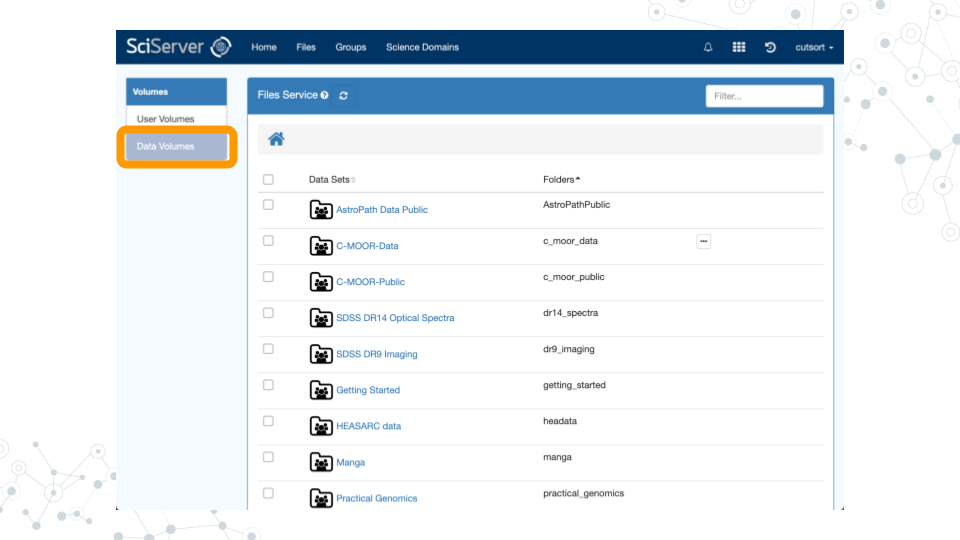
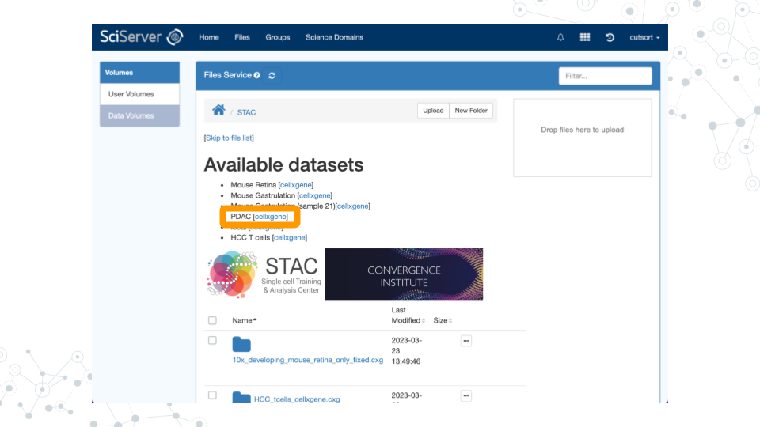

# cellxgene

## Learning Objectives
- Confirm access to STAC Administrators Group
- Launch cellxgene
- Edit SciServer Dashboard

## Instructions

### Confirm Access

1. Go to [sciserver.org](https://sciserver.org) and click on "**Login to SciServer**".


2. Log in with the SciServer account you created in Part 1.



3. Once logged in, you will see options on the top menu bar of the homepage/Dashboard (Home, Files, Groups, and various options for Compute). Confirm that you received and accepted the invitation to the STAC Administrators Group by clicking on “**Groups**” in the top menu bar.


4. Click on “**STAC Administrators**” in the left sidebar menu. You should see your username in the Members list on the right sidebar. You should also have access to the Shared Data Volume “STAC” and Share Compute Image “single-cell-explorer”.     



### Join Genomics Domain

1. Return to the [SciServer Dashboard](https://apps.sciserver.org/dashboard/).
2. Click on "**Science Domains**" in the top menu bar.



3. In the left sidebar menu titled "Science Domains", click on "**Genomics**".


4. Beneath the DNA logo image, click the "**Join**" button.


### Launch cellxgene

1. In order to explore the available datasets, click on “**Files**” in the top menu bar.



2. Click on “**Data Volumes**” in the left sidebar menu. 



3. Scroll down the page to find the data volume “**STAC**”. Click on the name to access the dashboard.


4. Under the “Available datasets” heading, click on “**PDAC [cellxgene]**”.



5. cellxgene should now launch with your dataset of interest ready to explore!


### Edit Dashboard

1. Click on "**Files**" in the top menu bar.
2. Click on “**Data Volumes**” in the left sidebar menu.
3. Scroll down the page to find the data volume “**STAC**”. Click on the name to access the dashboard.
4. Scroll to the bottom of the page and find the “README.md” file. Click on the three dots, then click “**View/Edit**”.
5. You should now be able to edit and improve the README file using standard Markdown syntax.                                                                                       
                                                                                       

```r
devtools::session_info()
```

```
## ─ Session info ───────────────────────────────────────────────────────────────
##  setting  value                       
##  version  R version 4.0.2 (2020-06-22)
##  os       Ubuntu 20.04.5 LTS          
##  system   x86_64, linux-gnu           
##  ui       X11                         
##  language (EN)                        
##  collate  en_US.UTF-8                 
##  ctype    en_US.UTF-8                 
##  tz       Etc/UTC                     
##  date     2023-07-19                  
## 
## ─ Packages ───────────────────────────────────────────────────────────────────
##  package     * version date       lib source                            
##  assertthat    0.2.1   2019-03-21 [1] RSPM (R 4.0.5)                    
##  bookdown      0.24    2023-03-28 [1] Github (rstudio/bookdown@88bc4ea) 
##  bslib         0.4.2   2022-12-16 [1] CRAN (R 4.0.2)                    
##  cachem        1.0.7   2023-02-24 [1] CRAN (R 4.0.2)                    
##  callr         3.5.0   2020-10-08 [1] RSPM (R 4.0.2)                    
##  cli           3.6.1   2023-03-23 [1] CRAN (R 4.0.2)                    
##  crayon        1.3.4   2017-09-16 [1] RSPM (R 4.0.0)                    
##  curl          4.3     2019-12-02 [1] RSPM (R 4.0.3)                    
##  desc          1.2.0   2018-05-01 [1] RSPM (R 4.0.3)                    
##  devtools      2.3.2   2020-09-18 [1] RSPM (R 4.0.3)                    
##  digest        0.6.25  2020-02-23 [1] RSPM (R 4.0.0)                    
##  ellipsis      0.3.1   2020-05-15 [1] RSPM (R 4.0.3)                    
##  evaluate      0.20    2023-01-17 [1] CRAN (R 4.0.2)                    
##  fansi         0.4.1   2020-01-08 [1] RSPM (R 4.0.0)                    
##  fastmap       1.1.1   2023-02-24 [1] CRAN (R 4.0.2)                    
##  fs            1.5.0   2020-07-31 [1] RSPM (R 4.0.3)                    
##  glue          1.4.2   2020-08-27 [1] RSPM (R 4.0.5)                    
##  highr         0.8     2019-03-20 [1] RSPM (R 4.0.3)                    
##  hms           0.5.3   2020-01-08 [1] RSPM (R 4.0.0)                    
##  htmltools     0.5.5   2023-03-23 [1] CRAN (R 4.0.2)                    
##  httr          1.4.2   2020-07-20 [1] RSPM (R 4.0.3)                    
##  jquerylib     0.1.4   2021-04-26 [1] CRAN (R 4.0.2)                    
##  jsonlite      1.7.1   2020-09-07 [1] RSPM (R 4.0.2)                    
##  knitr         1.33    2023-03-28 [1] Github (yihui/knitr@a1052d1)      
##  lifecycle     1.0.3   2022-10-07 [1] CRAN (R 4.0.2)                    
##  magrittr      2.0.3   2022-03-30 [1] CRAN (R 4.0.2)                    
##  memoise       2.0.1   2021-11-26 [1] CRAN (R 4.0.2)                    
##  ottrpal       1.0.1   2023-03-28 [1] Github (jhudsl/ottrpal@151e412)   
##  pillar        1.9.0   2023-03-22 [1] CRAN (R 4.0.2)                    
##  pkgbuild      1.1.0   2020-07-13 [1] RSPM (R 4.0.2)                    
##  pkgconfig     2.0.3   2019-09-22 [1] RSPM (R 4.0.3)                    
##  pkgload       1.1.0   2020-05-29 [1] RSPM (R 4.0.3)                    
##  prettyunits   1.1.1   2020-01-24 [1] RSPM (R 4.0.3)                    
##  processx      3.4.4   2020-09-03 [1] RSPM (R 4.0.2)                    
##  ps            1.4.0   2020-10-07 [1] RSPM (R 4.0.2)                    
##  R6            2.4.1   2019-11-12 [1] RSPM (R 4.0.0)                    
##  readr         1.4.0   2020-10-05 [1] RSPM (R 4.0.2)                    
##  remotes       2.2.0   2020-07-21 [1] RSPM (R 4.0.3)                    
##  rlang         1.1.0   2023-03-14 [1] CRAN (R 4.0.2)                    
##  rmarkdown     2.10    2023-03-28 [1] Github (rstudio/rmarkdown@02d3c25)
##  rprojroot     2.0.3   2022-04-02 [1] CRAN (R 4.0.2)                    
##  sass          0.4.5   2023-01-24 [1] CRAN (R 4.0.2)                    
##  sessioninfo   1.1.1   2018-11-05 [1] RSPM (R 4.0.3)                    
##  stringi       1.5.3   2020-09-09 [1] RSPM (R 4.0.3)                    
##  stringr       1.4.0   2019-02-10 [1] RSPM (R 4.0.3)                    
##  testthat      3.0.1   2023-03-28 [1] Github (R-lib/testthat@e99155a)   
##  tibble        3.2.1   2023-03-20 [1] CRAN (R 4.0.2)                    
##  usethis       1.6.3   2020-09-17 [1] RSPM (R 4.0.2)                    
##  utf8          1.1.4   2018-05-24 [1] RSPM (R 4.0.3)                    
##  vctrs         0.6.1   2023-03-22 [1] CRAN (R 4.0.2)                    
##  withr         2.3.0   2020-09-22 [1] RSPM (R 4.0.2)                    
##  xfun          0.26    2023-03-28 [1] Github (yihui/xfun@74c2a66)       
##  yaml          2.2.1   2020-02-01 [1] RSPM (R 4.0.3)                    
## 
## [1] /usr/local/lib/R/site-library
## [2] /usr/local/lib/R/library
```
