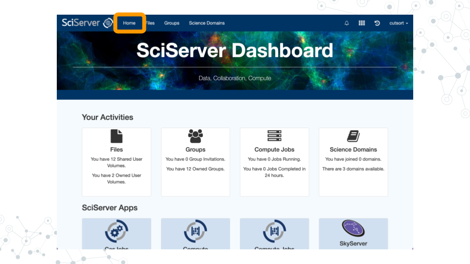
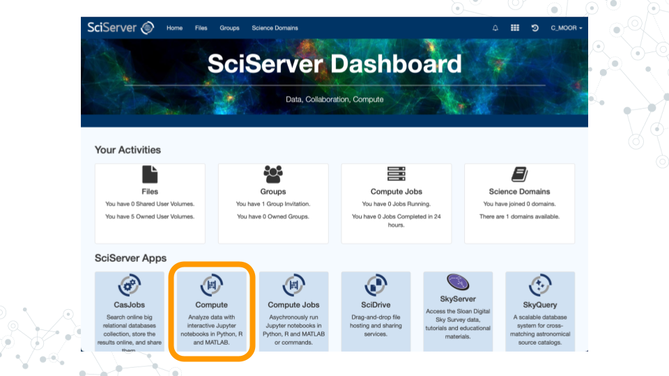
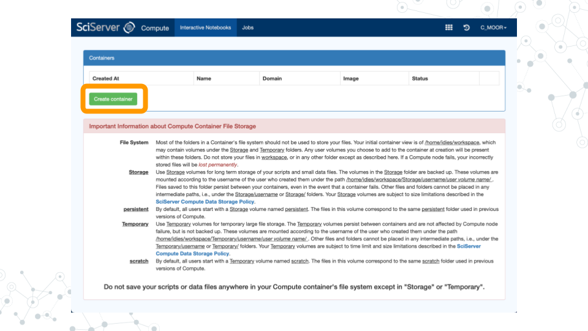
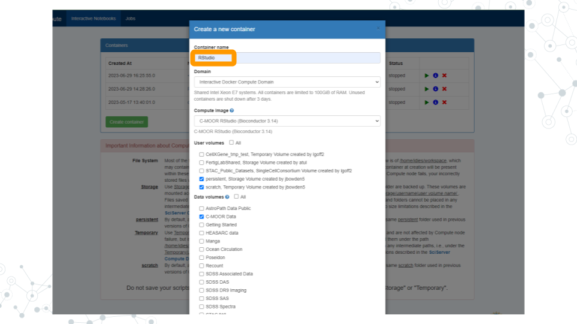
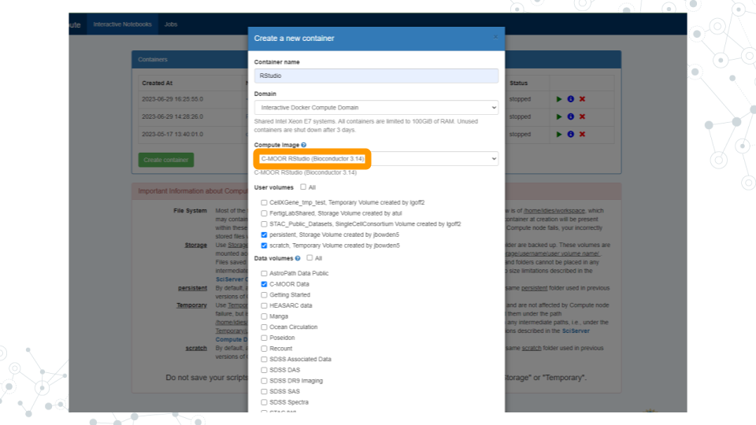
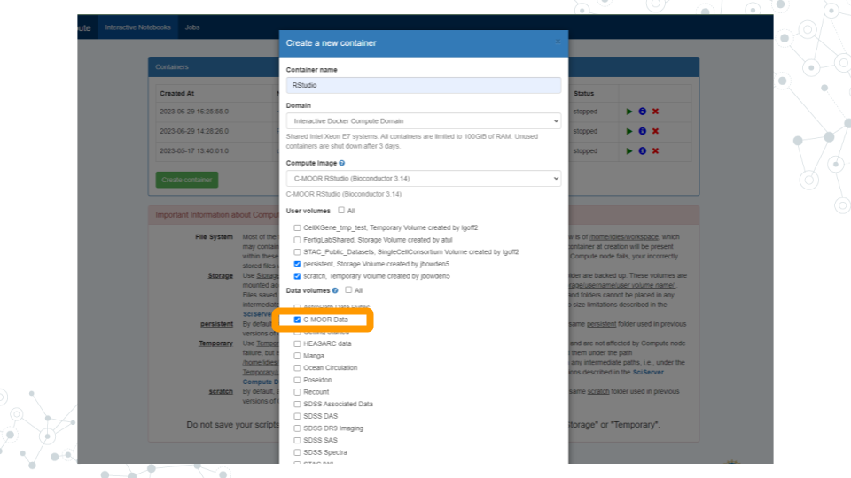
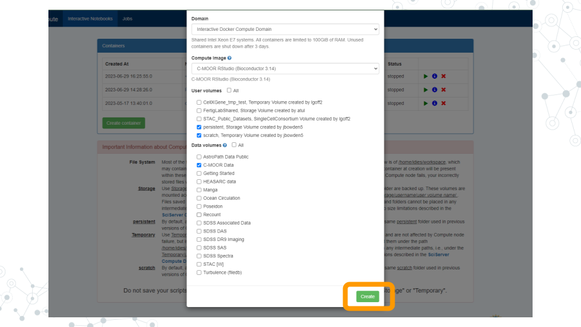
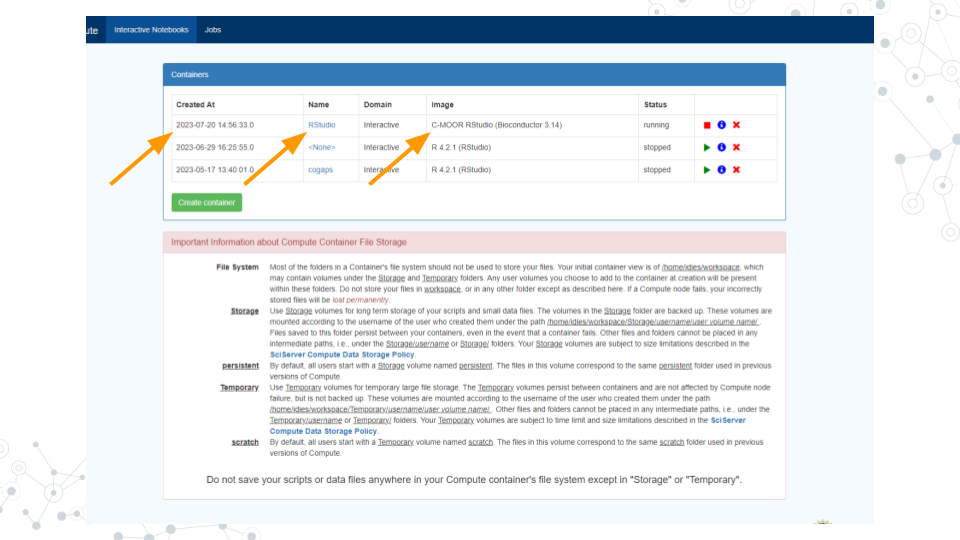
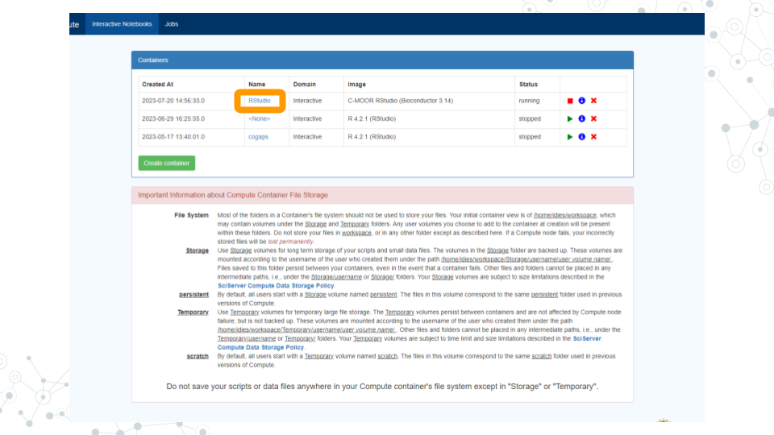
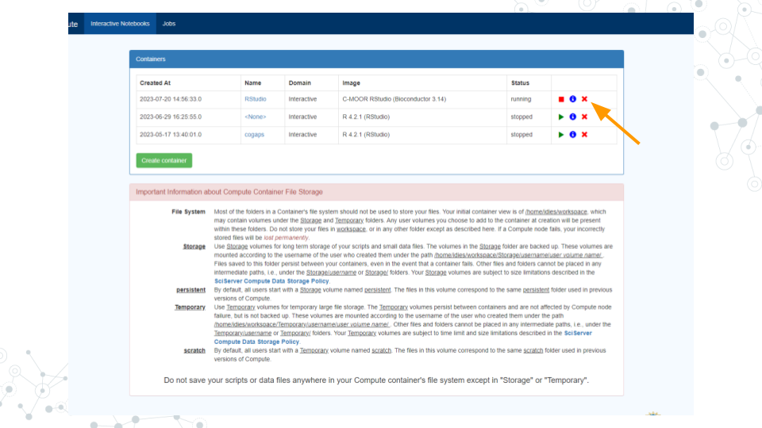

# R/RStudio

## Learning Objectives
- Start up a C-MOOR RStudio compute container
- Find and use features of RStudio: R console, help window, viewer, environment window, history.
- Complete your first “swirl” tutorial

## Introduction

Before beginning this assignment, you should have already created a SciServer account and submitted your SciServer username to your instructor. In this assignment you will learn how to set up the “C-MOOR RStudio” compute container on SciServer. You will learn the basics of how to use RStudio, and will practice doing R coding within RStudio. You will also do your first “swirl” lesson. Swirl is a set of R tutorials that run inside RStudio.

## Instructions

### Start up a "C-MOOR RStudio" compute container

1. Open [sciserver.org](https://sciserver.org) in a web browser and log in to your account.


  &nbsp;&nbsp;&nbsp;&nbsp;&nbsp; a. If you’re already logged in, click “**Home**” in the top menu bar to return to the home page.



2. Scroll down to the second set of boxes and click “**Compute**”.



3. Click "**Create container**".


  
  &nbsp;&nbsp;&nbsp;&nbsp;&nbsp; a. Give your container a name. This can be anything you like, but it’s useful if it says something about the purpose of the container so that you can tell your containers apart. You could name this container “RStudio”, since you’ll be using it to access RStudio.


  
  &nbsp;&nbsp;&nbsp;&nbsp;&nbsp; b. In the “**Compute Image**” drop-down menu, select “**C-MOOR RStudio**”.


  
  &nbsp;&nbsp;&nbsp;&nbsp;&nbsp; c. Under “**Data Volumes**”, check the box next to “**C-MOOR Data**”.


 
  &nbsp;&nbsp;&nbsp;&nbsp;&nbsp; d. Click “**Create**”. This may take a moment.



4. You should now see a new entry in your list of containers.


 
  &nbsp;&nbsp;&nbsp;&nbsp;&nbsp; a. “Created At” should be a few moments ago.

  &nbsp;&nbsp;&nbsp;&nbsp;&nbsp; b. “Name” should be the name you chose.

  &nbsp;&nbsp;&nbsp;&nbsp;&nbsp; c. “Image” should be “C-MOOR RStudio".

5. Start your C-MOOR RStudio container by clicking on its **name** (whatever name you chose when you created the container). This will open in a new tab.


  
  &nbsp;&nbsp;&nbsp;&nbsp;&nbsp; a. You should see RStudio in this new tab.


  &nbsp;&nbsp;&nbsp;&nbsp;&nbsp; b. If you see something else, you may have picked the wrong “Compute Image” from the drop-down menu.

**If anything goes wrong, you can always delete your container by clicking the red “X” in the last column, and create a new container.**



### Complete your first swirl tutorial

1. Watch this 90 second video tour of RStudio:

<iframe width="560" height="315" src="https://www.youtube.com/embed/n3uue28FD0w" title="YouTube video player" frameborder="0" allow="accelerometer; autoplay; clipboard-write; encrypted-media; gyroscope; picture-in-picture; web-share" allowfullscreen></iframe>

2. If you’re not there already, go to the SciServer compute page and start up the C-MOOR RStudio container.
  
  &nbsp;&nbsp;&nbsp;&nbsp;&nbsp; a. Open [sciserver.org](https://sciserver.org) in a web browser and log in to your account.
 
  &nbsp;&nbsp;&nbsp;&nbsp;&nbsp; b. If you’re already logged in, click “**Home**” in the top menu bar to return to the home page.
 
  &nbsp;&nbsp;&nbsp;&nbsp;&nbsp; c. Scroll down to the second set of boxes and click “**Compute**”.
 
  &nbsp;&nbsp;&nbsp;&nbsp;&nbsp; d. Start your C-MOOR container by clicking on its name.

3. In the **R console** window of RStudio (bottom left, or if you have no files open, it may take up the whole left side of the screen) type these commands to start up swirl:
  
  &nbsp;&nbsp;&nbsp;&nbsp;&nbsp; a. ```library(swirl)```
 
  &nbsp;&nbsp;&nbsp;&nbsp;&nbsp; b. ```swirl()```

4. Install the course, following the instructions provided by swirl:
 
  &nbsp;&nbsp;&nbsp;&nbsp;&nbsp; a. Enter your name

  &nbsp;&nbsp;&nbsp;&nbsp;&nbsp; b. Press ENTER

  &nbsp;&nbsp;&nbsp;&nbsp;&nbsp; c. Select 1, 2, or 3

  &nbsp;&nbsp;&nbsp;&nbsp;&nbsp; d. Install the course: "**R Programming: The basics of programming in R**".

5. Complete your first swirl lesson.
  
  &nbsp;&nbsp;&nbsp;&nbsp;&nbsp; a. Choose the "**R programming**" course.

  &nbsp;&nbsp;&nbsp;&nbsp;&nbsp; b. Choose Lesson 1 "**Basic Building Blocks**".

  &nbsp;&nbsp;&nbsp;&nbsp;&nbsp; c. Follow the instructions provided by swirl to complete the lesson.

  &nbsp;&nbsp;&nbsp;&nbsp;&nbsp; d. When you get to the end, it will ask if you want credit on Coursera. Choose “**No**” (we are not using Coursera for this course).

6. Congratulations! You have successfully completed the first lesson in swirl, Basic Building Blocks!

### Managing your C-MOOR RStudio compute container

If you delete your container now, you will lose **all** your progress in swirl. If you need to return to any part of the tutorial later, it is a good idea to keep the container until you are sure that you’re finished using it.
