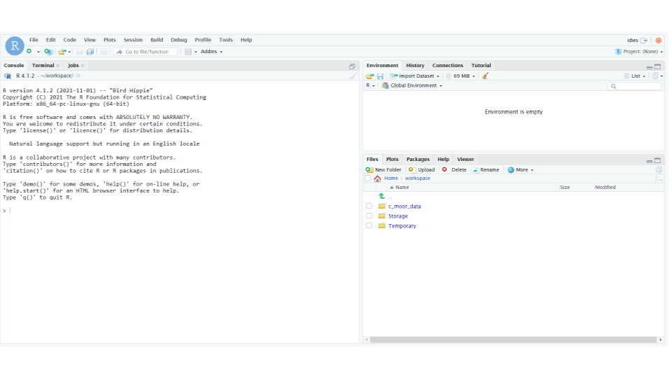
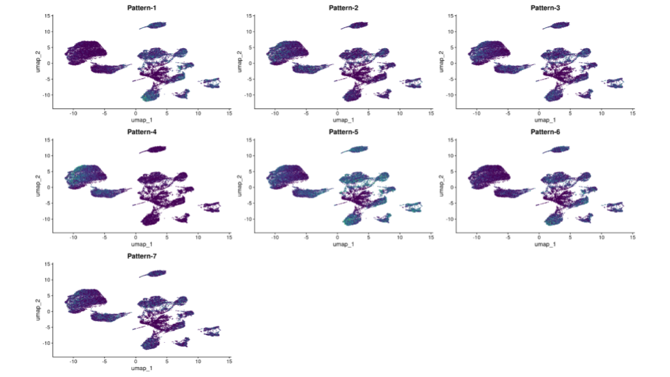

# CoGAPS

## Learning Objectives

- Learn about CoGAPS
- How to load packages in RStudio
- How to load data in RStudio
- How to configure CoGAPS
- How to run CoGAPS
- How to visualize patterns
- How to find pattern markers
- How to document software

## What is CoGAPS?

CoGAPS (Coordinated Gene Activity across Pattern Subsets) is a Bayesian NMF (Nonnegative Matrix Factorization) algorithm. It can be used to perform sparse matrix factorization on any data, and when this data represents biomolecules, to do gene set analysis. CoGAPS improves on other enrichment measurement methods by combining a Markov chain Monte Carlo (MCMC) matrix factorization algorithm (GAPS) with a threshold-independent statistic inferring activity on gene sets.

## What is CoGAPS used for?

CoGAPS can be used to perform sparse matrix factorization on any data. And when this data represents biomolecules, to do gene set analysis.

## Instructions

### Start up a "CoGAPS RStudio" compute container

1. Open [sciserver.org](https://sciserver.org) in a web browser and log in to your account.

&nbsp;&nbsp;&nbsp;&nbsp;&nbsp; a. If you're already logged in, click "**Home**" in the top menu bar to return to the home page.

2. Scroll down to the second set of boxes and click "**Compute**".

3. Click "**Create container**"

&nbsp;&nbsp;&nbsp;&nbsp;&nbsp; a. Give your container a name. This can be anything you like, but it’s useful if it says something about the purpose of the container so that you can tell your containers apart. You could name this container “CoGAPS”, since you’ll be using it to run CoGAPS.

&nbsp;&nbsp;&nbsp;&nbsp;&nbsp; b. In the “**Compute Image**” drop-down menu, select “**R [version #] (RStudio)**” (there may be multiple versions of R in this drop-down menu; click on the latest version listed).

&nbsp;&nbsp;&nbsp;&nbsp;&nbsp; c. Click "**Create**". This may take a moment.

4. You should now see a new entry in your list of containers.

&nbsp;&nbsp;&nbsp;&nbsp;&nbsp; a. "Created at" should be a few moments ago.

&nbsp;&nbsp;&nbsp;&nbsp;&nbsp; b. "Name" should be the name you chose.

&nbsp;&nbsp;&nbsp;&nbsp;&nbsp; c. "Image" should be ```"R[version #](RStudio)"```

5. Start your CoGAPS RStudio container by clicking on its **name** (whatever name you chose when you created the container). This will open in a new tab.

&nbsp;&nbsp;&nbsp;&nbsp;&nbsp; a. You should see RStudio.



&nbsp;&nbsp;&nbsp;&nbsp;&nbsp; b. If you see something else, you may have picked the wrong "Compute Image" from the drop-down menu.

**If anything goes wrong, you can always delete your container by clicking the red “X” in the last column, and create a new container.**

### Update rlang

1. Enter and run these commands into RStudio to make sure that you have the current version of ```rlang``` (you will receive an error later on otherwise):

```
packageVersion("rlang") # ‘1.0.6’
devtools::install_github("r-lib/rlang")
packageVersion("rlang") # ‘1.1.0.9000’
```

2. Once you see the output: ```[1] '1.1.1.9000'``` rlang has been updated.

### Install Packages

1. Enter and run this command:

```
devtools::install_github("FertigLab/CoGAPS")
```

2. This <u>will</u> take a while. Once the red "STOP" symbol is no longer visible in the top right hand corner of the Console, the installation is complete.

3. Enter and run this command:

```
devtools::install_github("sjmgarnier/viridis")
```

4. Once the red “STOP” symbol is no longer visible in the top right hand corner of the Console, the installation is complete.

5. Enter and run this command:

```
remotes::install_github("satijalab/seurat", "seurat5", quiet = TRUE)
```

6. This <u>will</u> take a while. Once the red "STOP" symbol is no longer visible in the top right hand corner of the Console, the installation is complete.

### Load Packages

1. Enter and run these commands:

```
library( "CoGAPS" )
library( "Seurat" )
library( "viridis" )
```

2. Once the red “STOP” symbol is no longer visible in the top right hand corner of the Console, the packages have been loaded.

### Load Data

1. Enter and run this command:

```
url <- "https://github.com/FertigLab/CoGAPS/raw/master/data/inputdata.Rds"
download.file( url, "inputdata.Rds" )
```

2. You should see this output if the run is successful:

```
trying URL 'https://github.com/FertigLab/CoGAPS/raw/master/data/inputdata.Rds'
Content type 'application/octet-stream' length 433262849 bytes (413.2 MB)
==================================================
downloaded 413.2 MB
```

3. Enter and run this command:

```
pdac_data <- readRDS( "inputdata.Rds" )
pdac_data
```

4. You should see this output if the run is successful:

```
An object of class Seurat 
15184 features across 25442 samples within 2 assays 
Active assay: originalexp (15176 features, 2000 variable features)
 1 other assay present: CoGAPS
 5 dimensional reductions calculated: PCA, Aligned, UMAP, pca, umap
```

5. Enter and run this command:

```
pdac_epi_counts <- as.matrix( pdac_data@assays$originalexp@counts )
```

6. You should see this output if the run is successful:

```
Warning: sparse->dense coercion: allocating vector of size 2.9 GiB
```

### Configure CoGAPS

1. Enter and run this command:

```
pdac_params <- CogapsParams(
  nIterations=100,          # run for 100 iterations 
  seed=42,                  # for consistency across stochastic runs
  nPatterns=8,              # each thread will learn 8 patterns
  sparseOptimization=TRUE,  # optimize for sparse data
  distributed="genome-wide" # parallelize across sets
)
```

2. Enter and run this command:

```
pdac_params <- setDistributedParams( pdac_params, nSets=7 )
```

3. You should see this output if the run is successful:

```
setting distributed parameters - call this again if you change nPatterns
```

### Run CoGAPS

1. Enter and run this command:

```
Sys.time()
```

2. Your output should include today's date and time.

3. Enter and run this command:

```
pdac_epi_result <- CoGAPS( pdac_epi_counts, pdac_params )
```

4. You should see this output if the run is successful (This <u>will</u> take a while, most likely around 20+ minutes):

```
This is CoGAPS version 3.19.1 
Running genome-wide CoGAPS on pdac_epi_counts (15176 genes and 25442 samples) with parameters:

-- Standard Parameters --
nPatterns            8 
nIterations          100 
seed                 42 
sparseOptimization   TRUE 
distributed          genome-wide 

-- Sparsity Parameters --
alpha          0.01 
maxGibbsMass   100 

-- Distributed CoGAPS Parameters -- 
nSets          7 
cut            8 
minNS          4 
maxNS          11 

Creating subsets...
set sizes (min, mean, max): (2168, 2168, 2168)
Running Across Subsets...

Data Model: Sparse, Normal
Sampler Type: Sequential
Loading Data...
Warning: Large values detected, is data log transformed?

Warning: Large values detected, is data log transformed?

Warning: Large values detected, is data log transformed?

Warning: Large values detected, is data log transformed?

Warning: Large values detected, is data log transformed?
Done! (00:00:36)
    worker 1 is starting!
-- Equilibration Phase --

Warning: Large values detected, is data log transformed?
    worker 6 is starting!

Warning: Large values detected, is data log transformed?
    worker 4 is starting!

Warning: Large values detected, is data log transformed?

Warning: Large values detected, is data log transformed?
    worker 5 is starting!

Warning: Large values detected, is data log transformed?

Warning: Large values detected, is data log transformed?
    worker 3 is starting!

Warning: Large values detected, is data log transformed?
    worker 7 is starting!

Warning: Large values detected, is data log transformed?

Warning: Large values detected, is data log transformed?
    worker 2 is starting!
-- Sampling Phase --
    worker 2 is finished! Time: 00:18:04
    worker 7 is finished! Time: 00:18:20
    worker 4 is finished! Time: 00:18:49
    worker 3 is finished! Time: 00:18:42
    worker 6 is finished! Time: 00:18:59
    worker 1 is finished! Time: 00:19:09
    worker 5 is finished! Time: 00:19:19

Matching Patterns Across Subsets…
Running Final Stage...

Connected to your session in progress, last started 2023-Jun-29 16:26:07 UTC (3 hours ago)
Data Model: Sparse, Normal
Sampler Type: Sequential
Loading Data...
Warning: Large values detected, is data log transformed?

Warning: Large values detected, is data log transformed?

Warning: Large values detected, is data log transformed?

Warning: Large values detected, is data log transformed?
Done! (00:00:29)
    worker 1 is starting!
-- Equilibration Phase --

Warning: Large values detected, is data log transformed?
    worker 5 is starting!

Warning: Large values detected, is data log transformed?

Warning: Large values detected, is data log transformed?
    worker 4 is starting!

Warning: Large values detected, is data log transformed?

Warning: Large values detected, is data log transformed?
    worker 6 is starting!

Warning: Large values detected, is data log transformed?
    worker 2 is starting!

Warning: Large values detected, is data log transformed?

Warning: Large values detected, is data log transformed?

Warning: Large values detected, is data log transformed?
    worker 3 is starting!

Warning: Large values detected, is data log transformed?
    worker 7 is starting!
-- Sampling Phase --
   worker 1 is finished! Time: 00:17:04
    worker 6 is finished! Time: 00:17:04
    worker 5 is finished! Time: 00:17:16
    worker 4 is finished! Time: 00:17:15
    worker 7 is finished! Time: 00:17:07
    worker 2 is finished! Time: 00:17:17
    worker 3 is finished! Time: 00:17:11
```

5. Enter and run this command:

```
Sys.time()
```

6. Your output should include today's date and time.

7. Enter and run this command:

```
saveRDS( pdac_epi_result, "../data/pdac_epi_cogaps_result" )
```

8. You should see this output if the run is successful:

```
Warning: cannot open compressed file '../data/pdac_epi_cogaps_result', probable reason 'No such file or directory'Error in gzfile(file, mode) : cannot open the connection
```

9. Enter and run this command:

```
pdac_epi_result
```

10. You should see this output if the run is successful:

```
[1] "CogapsResult object with 15176 features and 25442 samples"
[1] "7 patterns were learned"
```

11. Enter and run this command in order to save your results:

```
saveRDS( pdac_epi_result, "pdac_epi_cogaps_result.rds" )
```

### Visualize Patterns

1. Enter and run this command:

```
cogapsresult <- readRDS( "pdac_epi_cogaps_result.rds" )
```

2. Enter and run this command:

```
patterns_in_order <- t( cogapsresult@sampleFactors[colnames(pdac_data),] )
pdac_data[["CoGAPS"]] <- CreateAssayObject( counts = patterns_in_order )
```

3. You should receive this output:

```
Warning: Feature names cannot have underscores ('_'), replacing with dashes ('-')
```

4. Enter and run this command:

```
inputdata <- pdac_data
DefaultAssay(inputdata) <- "CoGAPS"
pattern_names = rownames( inputdata@assays$CoGAPS )
```

5. Enter and run this command:

```
color_palette <- viridis(n=10)
FeaturePlot(inputdata, pattern_names, cols=color_palette, reduction = "umap") & NoLegend()
```

6. Your output should look like this if the run was successful (visible in the bottom right corner of your screen):



### Find Pattern Markers

1. Enter and run this command:

```
pm <- patternMarkers( cogapsresult, threshold="cut" )
```

2. You should see this output if the run was successful:

```
Warning: STATS is longer than the extent of 'dim(x)[MARGIN]'
```

3. Enter and run this command:

```
# hallmarks <- PatternHallmarks( cogapsresult )
```

4. Enter and run this command:

```
# plotPatternHallmarks(hallmarks, whichpattern = 7)
```

### Document Software

1. Enter and run this command:

```
sessionInfo()
```

2. Your output should include all the information about your RStudio session.

**Troubleshooting/Reminders:**

- If you restart RStudio, you must repeat the [Load Packages](https://practicalgenomics.github.io/cogaps-on-sciserver/cogaps.html#load-packages) step, otherwise errors will occur and you will not be able to successfully run your code.

## Resources

[CoGAPS Guide Website](https://fertiglab.github.io/CoGAPSGuide/)


```r
devtools::session_info()
```

```
## ─ Session info ───────────────────────────────────────────────────────────────
##  setting  value                       
##  version  R version 4.0.2 (2020-06-22)
##  os       Ubuntu 20.04.5 LTS          
##  system   x86_64, linux-gnu           
##  ui       X11                         
##  language (EN)                        
##  collate  en_US.UTF-8                 
##  ctype    en_US.UTF-8                 
##  tz       Etc/UTC                     
##  date     2023-07-07                  
## 
## ─ Packages ───────────────────────────────────────────────────────────────────
##  package     * version date       lib source                            
##  assertthat    0.2.1   2019-03-21 [1] RSPM (R 4.0.5)                    
##  bookdown      0.24    2023-03-28 [1] Github (rstudio/bookdown@88bc4ea) 
##  bslib         0.4.2   2022-12-16 [1] CRAN (R 4.0.2)                    
##  cachem        1.0.7   2023-02-24 [1] CRAN (R 4.0.2)                    
##  callr         3.5.0   2020-10-08 [1] RSPM (R 4.0.2)                    
##  cli           3.6.1   2023-03-23 [1] CRAN (R 4.0.2)                    
##  crayon        1.3.4   2017-09-16 [1] RSPM (R 4.0.0)                    
##  curl          4.3     2019-12-02 [1] RSPM (R 4.0.3)                    
##  desc          1.2.0   2018-05-01 [1] RSPM (R 4.0.3)                    
##  devtools      2.3.2   2020-09-18 [1] RSPM (R 4.0.3)                    
##  digest        0.6.25  2020-02-23 [1] RSPM (R 4.0.0)                    
##  ellipsis      0.3.1   2020-05-15 [1] RSPM (R 4.0.3)                    
##  evaluate      0.20    2023-01-17 [1] CRAN (R 4.0.2)                    
##  fansi         0.4.1   2020-01-08 [1] RSPM (R 4.0.0)                    
##  fastmap       1.1.1   2023-02-24 [1] CRAN (R 4.0.2)                    
##  fs            1.5.0   2020-07-31 [1] RSPM (R 4.0.3)                    
##  glue          1.4.2   2020-08-27 [1] RSPM (R 4.0.5)                    
##  highr         0.8     2019-03-20 [1] RSPM (R 4.0.3)                    
##  hms           0.5.3   2020-01-08 [1] RSPM (R 4.0.0)                    
##  htmltools     0.5.5   2023-03-23 [1] CRAN (R 4.0.2)                    
##  httr          1.4.2   2020-07-20 [1] RSPM (R 4.0.3)                    
##  jquerylib     0.1.4   2021-04-26 [1] CRAN (R 4.0.2)                    
##  jsonlite      1.7.1   2020-09-07 [1] RSPM (R 4.0.2)                    
##  knitr         1.33    2023-03-28 [1] Github (yihui/knitr@a1052d1)      
##  lifecycle     1.0.3   2022-10-07 [1] CRAN (R 4.0.2)                    
##  magrittr      2.0.3   2022-03-30 [1] CRAN (R 4.0.2)                    
##  memoise       2.0.1   2021-11-26 [1] CRAN (R 4.0.2)                    
##  ottrpal       1.0.1   2023-03-28 [1] Github (jhudsl/ottrpal@151e412)   
##  pillar        1.9.0   2023-03-22 [1] CRAN (R 4.0.2)                    
##  pkgbuild      1.1.0   2020-07-13 [1] RSPM (R 4.0.2)                    
##  pkgconfig     2.0.3   2019-09-22 [1] RSPM (R 4.0.3)                    
##  pkgload       1.1.0   2020-05-29 [1] RSPM (R 4.0.3)                    
##  prettyunits   1.1.1   2020-01-24 [1] RSPM (R 4.0.3)                    
##  processx      3.4.4   2020-09-03 [1] RSPM (R 4.0.2)                    
##  ps            1.4.0   2020-10-07 [1] RSPM (R 4.0.2)                    
##  R6            2.4.1   2019-11-12 [1] RSPM (R 4.0.0)                    
##  readr         1.4.0   2020-10-05 [1] RSPM (R 4.0.2)                    
##  remotes       2.2.0   2020-07-21 [1] RSPM (R 4.0.3)                    
##  rlang         1.1.0   2023-03-14 [1] CRAN (R 4.0.2)                    
##  rmarkdown     2.10    2023-03-28 [1] Github (rstudio/rmarkdown@02d3c25)
##  rprojroot     2.0.3   2022-04-02 [1] CRAN (R 4.0.2)                    
##  sass          0.4.5   2023-01-24 [1] CRAN (R 4.0.2)                    
##  sessioninfo   1.1.1   2018-11-05 [1] RSPM (R 4.0.3)                    
##  stringi       1.5.3   2020-09-09 [1] RSPM (R 4.0.3)                    
##  stringr       1.4.0   2019-02-10 [1] RSPM (R 4.0.3)                    
##  testthat      3.0.1   2023-03-28 [1] Github (R-lib/testthat@e99155a)   
##  tibble        3.2.1   2023-03-20 [1] CRAN (R 4.0.2)                    
##  usethis       1.6.3   2020-09-17 [1] RSPM (R 4.0.2)                    
##  utf8          1.1.4   2018-05-24 [1] RSPM (R 4.0.3)                    
##  vctrs         0.6.1   2023-03-22 [1] CRAN (R 4.0.2)                    
##  withr         2.3.0   2020-09-22 [1] RSPM (R 4.0.2)                    
##  xfun          0.26    2023-03-28 [1] Github (yihui/xfun@74c2a66)       
##  yaml          2.2.1   2020-02-01 [1] RSPM (R 4.0.3)                    
## 
## [1] /usr/local/lib/R/site-library
## [2] /usr/local/lib/R/library
```
